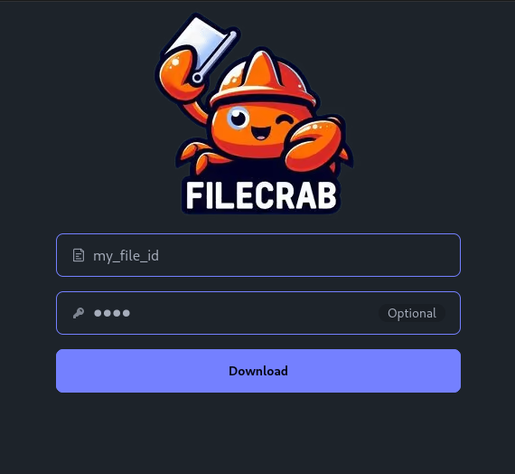

<div align="center">
  
  <h3>⚡ A blazingly fast file and text sharing service ⚡</h3>


</div>

## What's Filecrab?

File and text sharing application, built on top of [MinIO](https://min.io/) and
[SurrealDB](https://surrealdb.com/) and powered by [Rust](https://www.rust-lang.org/). You can host
your own instance, simply need a MinIO bucket and a SurrealDB instance.

A useful [CLI](#cli) will allow you to upload files and text to an instance.

## Features

- File sharing.
- File expiration.
- **One-time** text sharing.
- Files **optionally** encrypted.
- Text **always** encrypted.
- Server-side cleanup of expired files and text based on user defined interval.
- Memorable words list for IDs, inspired by
  [Magic Wormhole](https://github.com/magic-wormhole/magic-wormhole.rs).
- Server can be run in distant or embedded mode.
- The cli can manage multiple instances of filecrab.
- A web front end to download files directly from the web.

## Security

All data is encrypted through the [age](https://github.com/str4d/rage/tree/main/age) library.
Encryption is done **client side**, in the CLI tool, this allows us to stream files directly to the
storage without the need of reading it in memory on the server. The password is **never** sent to
the server.

## Table of Contents

- [Server](#server)
  - [Local](#local)
    - [Configuration](#configuration)
    - [Running](#running)
  - [Docker](#docker)
  - [Deployment](#deployment)
- [Web](#web)
  - [Deployment](#deployment-2)
  - [Running](#running-1)
- [CLI](#cli)
  - [Installation](#installation)
    - [Arch Linux](#arch-linux)
    - [From source](#from-source)
    - [From GitHub](#from-github)
  - [Usage](#usage)
    - [Set up](#set-up)
    - [Multi Instances](#multi-instances)
      - [Add](#add)
      - [Remove](#remove)
      - [Switch](#switch)
    - [Files](#files)
      - [Upload](#upload)
      - [Download](#download)
    - [Text](#text)
      - [Paste](#paste)
      - [Copy](#copy)
    - [Help](#help)

## Server

### Local

#### Configuration

The server can be configured with environment variables, see the [example](.env.example).

#### Running

You can run the application with all required services using the following commands:

```sh
# Build the filecrab Docker image.
just build
# Or if you want to build in release mode.
# just build release

# Run the multi-container application.
just up
```

> [!IMPORTANT]
> You will need to have [just](https://github.com/casey/just) installed to run the commands.

> [!NOTE]
> The server will be available at `http://localhost:8080`.

### Docker

Filecrab is also available as a [Docker Image](https://hub.docker.com/repository/docker/nicolasgoutte/filecrab).

There are two types of images available:

- `nicolasgoutte/filecrab:<TAG>` - Is the main image that runs the server and will connect to `surrealdb` via a websocket.
- `nicolasgoutte/filecrab:rocksdb-<TAG>` - Is an alternative image that runs the server and has an embedded `rocksdb` engine, meaning that there is **no need** to deploy a surrealdb, but data is written to the disk.

> [!NOTE]
> For more information on surrealdb, please refer to the [documentation](https://surrealdb.com/docs/surrealdb/introduction/architecture).

Chose the image that best fits your needs.

### Deployment

To deploy the server, you need to set up the following services:

- [MinIO](https://min.io/docs/minio/linux/operations/installation.html) - To store the files.
- [SurrealDB](https://surrealdb.com/docs/surrealdb/deployment/) - To store the metadata. (Not needed if running the `rocksdb` image).
- [Traefik](https://doc.traefik.io/traefik/getting-started/quick-start/) - To handle the reverse proxy. (Or any alternative to expose the server to the internet).
- [Filecrab](https://hub.docker.com/repository/docker/nicolasgoutte/filecrab) - The server itself.

#### Server configuration

Please refer to the [example](.env.example) for the server configuration.

## Web



You can deploy a front end fully made in Rust with [dioxus](https://dioxuslabs.com/). It will allow users to download files directly from the web. Useful for those not familiar with CLI tools.

### Deployment

You simply need to download the [docker image](https://hub.docker.com/repository/docker/nicolasgoutte/filecrab-web).

> [!WARNING]
> For the front end to be able to communicate to the backend you MUST deploy it under the same origin.
>
> Ex. Frontend: `https://my.filecrab.instance.com` then your backend should be under: `https://my.filecrab.instance.com/api`. Make sure when exposing `/api` has priority over the frontend.

## CLI

### Installation

#### Arch Linux

Use an AUR helper to install the package:

Here is an example with [paru](https://github.com/Morganamilo/paru)

```sh
paru -S filecrab-bin
```

#### From source

You can install the CLI with the following command:

```sh
cargo install --path filecrab-cli
```

#### From GitHub

- Go to the [releases](https://github.com/NicolasGB/filecrab/releases) page and download the latest version.
- Place the binary in somewhere in your `$PATH` so it can be executed from anywhere.

> [!WARNING]
> Remember to make the binary executable with `chmod +x filecrab`.

### Usage

#### Set up

The CLI needs to be configured with at least one instance of filecrab. You can either init de config via a command or on the first run, you will be asked to provide this information. Follow the instructions to set up the CLI.

```sh
filecrab init
```

You will be asked to set a name for the instance and then URL and API key.

> [!NOTE]
> The path to the configuration file is `~/.config/filecrab/config.toml`. You can edit it manually if needed.

#### Multi Instances

You can manage multiple instances of filecrab and switch easily between them. Each instance must have a name and cannot be the same as an existent one.

##### Add

Allows you to add a new instance of filecrab.

```sh
filecrab add
```

##### Remove

Allows you to remove an existing instance of filecrab.

```sh
filecrab remove
```

##### Switch

Allows you to switch the active instance used by the cli.

```sh
filecrab switch
```

#### Files

##### Upload

You can upload a file without encryption using the following command:

```sh
filecrab upload <PATH>
```

If you want to encrypt the file, you can use the `--pwd` flag:

```sh
filecrab upload <PATH> --pwd <PASSWORD>
```

##### Download

To download a file, you can use the following command, replacing `<ID>` with the `memorable_word_list` of the file:

```sh
filecrab download <ID>
```

If the file is encrypted, you need to provide the password with the `--pwd` flag:

```sh
filecrab download <ID> --pwd <PASSWORD>
```

> [!NOTE]
> By the file will be saved in the current directory with the original name.
> There is an optional flag `--path` to specify the path where the file will be saved.

```sh
filecrab download <ID> --path <PATH>
```

Or if the file is encrypted:

```sh
filecrab download <ID> --pwd <PASSWORD> --path <PATH>
```

#### Text

##### Paste

You can paste text to the server using the following command:

```sh
filecrab paste [CONTENT] --pwd <PASSWORD>
```

The password is mandatory as text is always encrypted in filecrab.

> [!NOTE]
> The content can be provided as an argument or piped to the command.

To pipe the content, you can use the following command:

```sh
echo "Hello, World!" | filecrab paste --pwd <PASSWORD>
```

Any text piped will be read by filecrab.

##### Copy

To copy a text, you can use the following command, replacing `<ID>` with the `memorable_word_list` of the text:

```sh
filecrab copy <ID> <PWD>
```

Filecrab will by default copy to the clipboard the content of the text. But you can output the content to the terminal using the `--output` flag:

```sh
filecrab copy <ID> <PWD> --output
```

#### Help

All the commands have a help message that can be accessed with the `--help` flag:

```sh
filecrab --help
```

## License

This project is licensed under the [MIT license](LICENSE).
